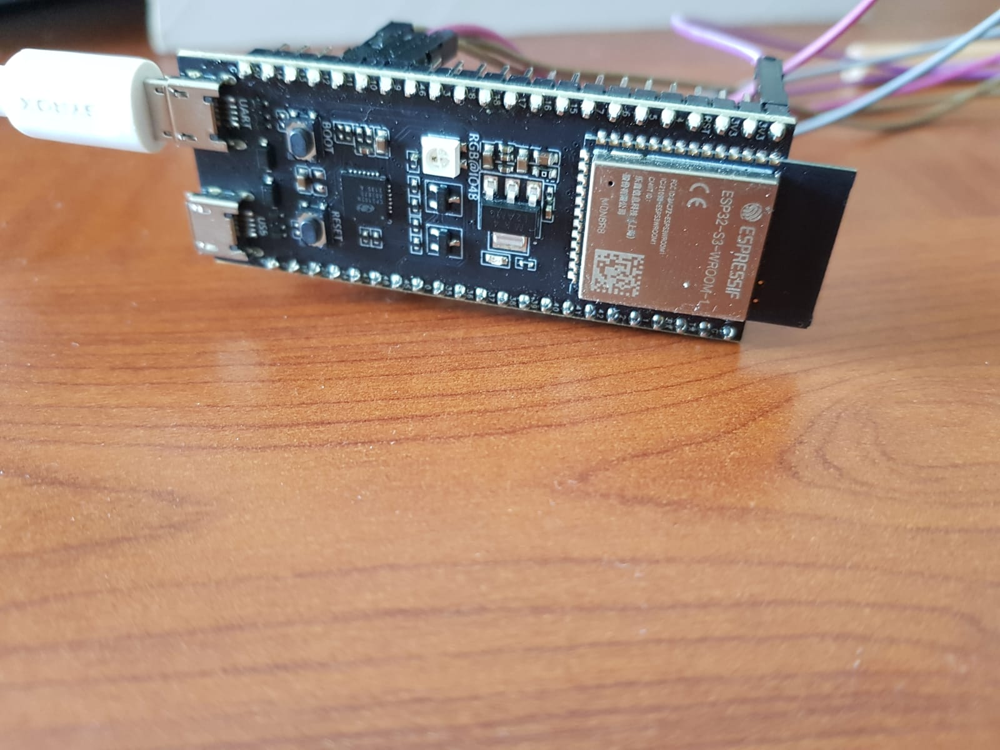
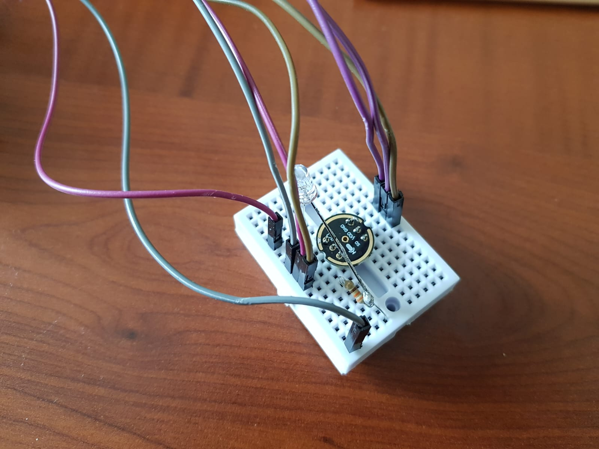
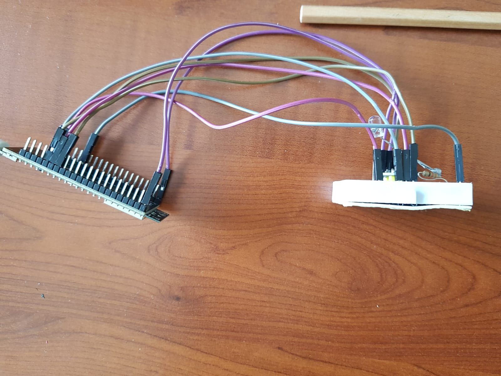
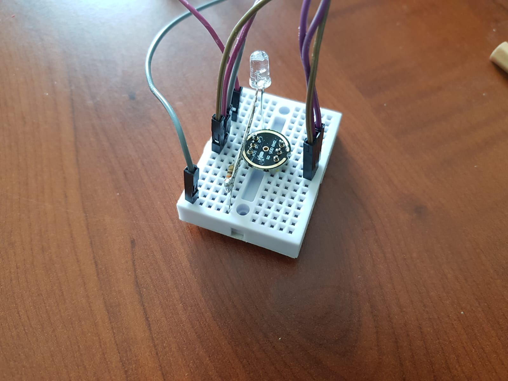

# ESP32-S3 Sound Recognition Project to Turn On and Turn Off the LED with INMP441 
## Actions Taken 
- **esp-idf** libraries required to run this code. Because this project runs on esp-idf not arduino environment. Vscode is used for text editing in this project. This youtube video instructions is followed: https://www.youtube.com/watch?v=3XbnzfBjmZk
1. With following instructions on this link, esp-idf is installed on pc: https://docs.espressif.com/projects/esp-idf/en/latest/esp32/get-started/linux-macos-setup.html
2. First this repo is cloned and the files are edited as done in referenced video: https://github.com/espressif/esp-skainet. But after making instructions on the video and trying to light the led on the esp32s3 the code wasn't compiling correctly. 
3. Then the same instructions is followed in the referenced video. And the INMP441 connections are made same as in the referenced youtube video.
4. Then, the https://github.com/0015/esp-skainet repo was copied. 
5. Then the **en_speech_commands_recognition** folder was opened from examples with vscode.
6. In order for idf.py to be found `. $HOME/Public/esp/esp-idf/export.sh` was run in the current folder.
7. After running the command: `idf.py build set-target esp32s3` the error returned saying: **memory is 2Mb but 7.1MB is being used.**
8. To fix it, after typing `idf.py menuconfig`, **Serial flasher config** section is selected then the serial flasher has been increased according to the flash size of esp32s3 from the config section.
9. Then in order to add the phonetic command python library is required and downloaded with `pip install g2p_en`
10. Then, phonetic command can be seen on the terminal after running this code: `python3 ~/Documents/esp-skainet/examples/en_speech_commands_recognition/managed_components/espressif__esp-sr/tool/multinet_g2p.py --text "tryout"`
11. Then this phonetic command is added to the list as done in referenced video.
12. Then the esp32s3 led is not worked as expected and not giving any output. So external led is connected to esp32s3 and the code updated accordingly.
13. Then the code is compiled successfully but microphone is not working now.
14. To test the microphone is not broken this repo is used and the code is runned on esp32s3: https://github.com/atomic14/esp32-i2s-mic-test. After running code the serial screen is giving output and microphone is okay.
15. After running sound recognition code on esp32s3 the it was noticed that the accent is important in order to wake the device. With google translate, wake word is played. Then the device waked up and executing instructions on switch cases.

